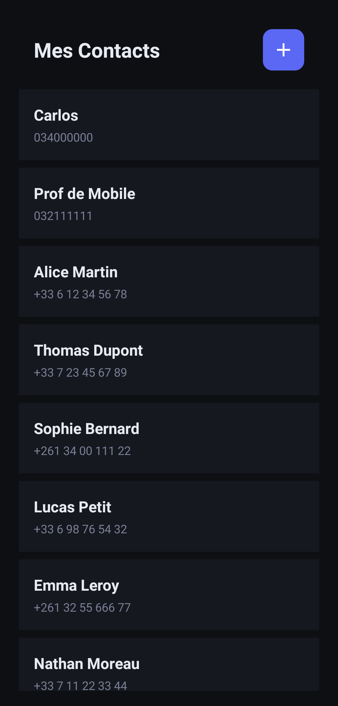
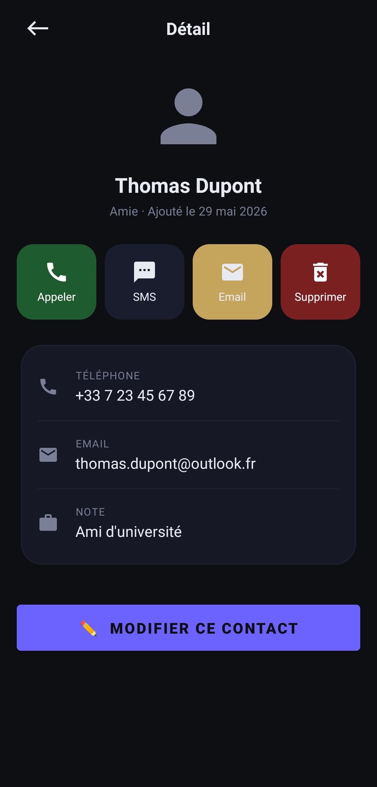
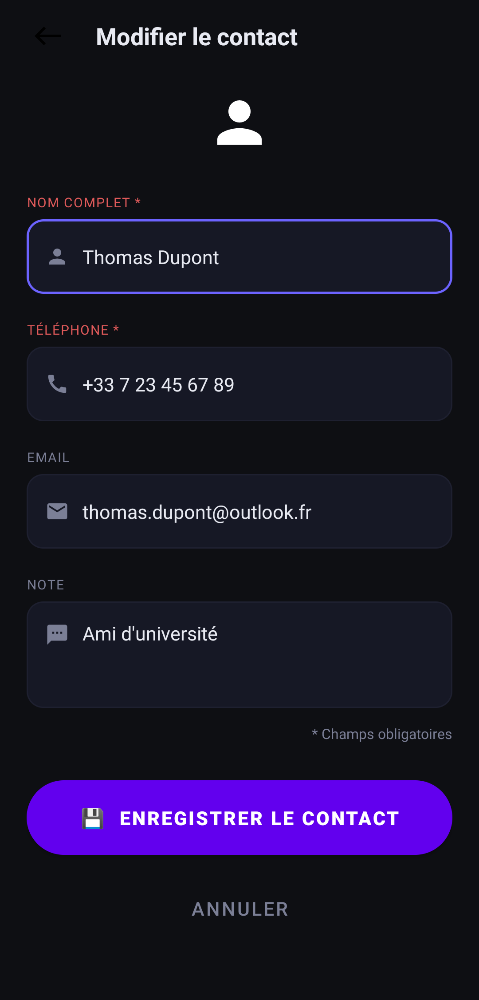

# 📱 MyContacts — Application Android

> Application Android de gestion de contacts développée en Java, avec persistance locale via **SQLite**.  
> Projet réalisé dans le cadre du cours de développement mobile.

---

## 📸 Aperçu des écrans

> Remplace les chemins ci-dessous par tes vraies captures d'écran (voir section [Comment capturer les screenshots](#-comment-capturer-les-screenshots))

| Écran 1 — Liste | Écran 2 — Détail | Écran 3 — Formulaire |
|:-:|:-:|:-:|
|  |  |  |

---

## ✅ Fonctionnalités

- 📋 **Lister** tous les contacts stockés localement
- 👤 **Afficher** le détail d'un contact (nom, téléphone, email, note, date d'ajout)
- ➕ **Ajouter** un nouveau contact avec validation des champs obligatoires
- ✏️ **Modifier** un contact existant
- 🗑️ **Supprimer** un contact avec confirmation
- 📞 **Appeler** directement depuis l'écran de détail (Intent implicite `ACTION_DIAL`)
- 💬 **Envoyer un SMS** depuis l'écran de détail (Intent implicite `ACTION_SENDTO`)
- 📧 **Envoyer un email** depuis l'écran de détail (Intent implicite `ACTION_SENDTO`)
- 📅 **Date d'ajout** enregistrée automatiquement et affichée en français (ex : `12 Mai 2024`)

---

## 🏗️ Architecture du projet

```
mg.carlos.mycontacts/
│
├── MainActivity.java         # Écran 1 — Liste des contacts (RecyclerView)
├── DetailActivity.java       # Écran 2 — Détail + actions (Appeler, SMS, Email, Supprimer)
├── EditerActivity.java       # Écran 3 — Formulaire (Ajout ET Modification)
│
├── Contact.java              # Modèle de données (id, nom, téléphone, email, note, date)
├── ContactAdapter.java       # Adapter RecyclerView pour afficher la liste
└── DatabaseHelper.java       # Gestion SQLite (création table, données de test)
```

### Navigation entre les écrans

```
MainActivity (Liste)
    │
    ├── Clic sur un contact ──────────────► DetailActivity (Détail)
    │                                            │
    │                                            ├── Bouton "Modifier" ──► EditerActivity
    │                                            └── Bouton "Supprimer" ── finish() → retour liste
    │
    └── Bouton ➕ ────────────────────────► EditerActivity (mode Ajout)
```

---

## 🗄️ Base de données

**Nom de la base :** `contacts.db`  
**Version :** `1`

### Structure de la table `contacts`

| Colonne | Type | Description |
|---|---|---|
| `id` | `INTEGER PRIMARY KEY AUTOINCREMENT` | Identifiant unique |
| `nom` | `VARCHAR` | Nom complet du contact |
| `telephone` | `VARCHAR` | Numéro de téléphone |
| `email` | `VARCHAR` | Adresse email |
| `note` | `VARCHAR` | Note libre |
| `date_creation` | `DATE DEFAULT (date('now'))` | Date d'ajout automatique |

### Requête de création

```sql
CREATE TABLE IF NOT EXISTS contacts(
    id INTEGER PRIMARY KEY AUTOINCREMENT,
    nom VARCHAR,
    telephone VARCHAR,
    email VARCHAR,
    note VARCHAR,
    date_creation DATE DEFAULT (date('now'))
);
```

---

## 🧪 Données de test

Les contacts suivants sont insérés automatiquement au premier lancement de l'application :

| # | Nom | Téléphone | Email | Note |
|---|---|---|---|---|
| 1 | Alice Martin | +33 6 12 34 56 78 | alice.martin@gmail.com | Collègue de travail |
| 2 | Thomas Dupont | +33 7 23 45 67 89 | thomas.dupont@outlook.fr | Ami d'université |
| 3 | Sophie Bernard | +261 34 00 111 22 | sophie.bernard@yahoo.fr | Voisine |
| 4 | Lucas Petit | +33 6 98 76 54 32 | lucas.petit@gmail.com | Cousin |
| 5 | Emma Leroy | +261 32 55 666 77 | emma.leroy@gmail.com | Amie proche |
| 6 | Nathan Moreau | +33 7 11 22 33 44 | nathan.moreau@hotmail.com | Collègue développeur |
| 7 | Camille Rousseau | +261 38 99 000 11 | camille.rousseau@gmail.com | Professeure |
| 8 | Hugo Garnier | +33 6 44 55 66 77 | hugo.garnier@free.fr | Frère |
| 9 | Inès Fontaine | +261 34 77 888 99 | ines.fontaine@gmail.com | Médecin de famille |
| 10 | Maxime Chevalier | +33 7 88 99 00 11 | maxime.chevalier@gmail.com | Chef de projet |

---

## 🛠️ Technologies utilisées

| Technologie | Usage |
|---|---|
| **Java** | Langage principal |
| **Android SDK** | Framework mobile |
| **SQLite** | Base de données locale |
| **RecyclerView** | Affichage de la liste des contacts |
| **Intent explicite** | Navigation entre les Activity |
| **Intent implicite** | Appel, SMS, Email |
| **AlertDialog** | Confirmation avant suppression |
| **SimpleDateFormat** | Formatage de la date en français |

---

## 🚀 Installation

### Prérequis

- **Android Studio Chipmunk | 2021.2.1 Patch 1**
- **Java 11** (OpenJDK 11.0.12 — fourni avec Android Studio)
- **Windows 10** ou supérieur
- SDK Android 21 minimum (Android 5.0)
- 4 cœurs CPU / 1280 Mo de mémoire alloués à l'IDE


### Étapes

1. **Cloner le dépôt**
   ```bash
   git clone https://github.com/razanakoto-carlos/MyContacts
   ```

2. **Ouvrir dans Android Studio**
   ```
   File → Open → sélectionner le dossier MyContacts
   ```

3. **Synchroniser Gradle**
   ```
   File → Sync Project with Gradle Files
   ```

4. **Lancer l'application**
   - Sur émulateur : `Run → Run 'app'`
   - Sur appareil physique : activer le **mode développeur** + **débogage USB**
   

---
## 📦 Télécharger l'APK

> Testé sur Android 5.0+ (API 21)

[](https://github.com/razanakoto-carlos/MyContacts/releases/download/1.0.0/MyContacts.apk)

---

## 👨‍💻 Auteur

**Carlos** — Étudiant en Geniel Logiciel 
Projet réalisé avec Android Studio · Java · SQLite

---